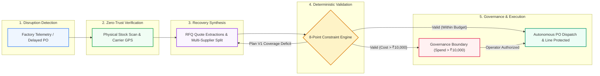

# NEXUS: Autonomous Supply-Chain Disruption & Procurement Recovery Engine

---

## 1. Team Details

* **Project Name**: NEXUS (Autonomous Supply Chain Disruption Recovery Agent)
* **Track / Hackathon**: Hackers Occupied Pune (HOP 2026)
* **Core Focus**: Autonomous Manufacturing Disruption Management, Zero-Trust Verification & Deterministic Constraint Procurement

---

## 2. Problem Statement in Short

Modern manufacturing supply chains operate under razor-thin inventory buffers. When sudden disruptions occur—such as in-transit shipment delays, dishonest supplier promises, abrupt demand surges, or factory capacity drop-offs—human procurement managers face overwhelming cognitive load. They must manually cross-reference ERP databases, request RFQ quotes across dozens of vendors, balance lead times against hard assembly deadlines, and ensure strict adherence to financial spending policies. 

Manual human coordination is slow, reactive, and prone to costly production shutdowns or unauthorized budget overruns. The challenge is building an autonomous agentic system capable of independently detecting disruptions, gathering verified ground truth, computing mathematically sound multi-supplier replenishment plans, and enforcing strict governance boundaries.

---

## 3. Understanding of the Problem Statement

Our team identified three fundamental failure modes in existing supply-chain software:
1. **The Telemetry & Ground-Truth Disconnect**: ERP inventory data is frequently stale or inaccurate (e.g. ERP reports 800 units, but physical warehouse usable stock is only 390). Agents relying on naive LLM assumptions fail because they make decisions on phantom data.
2. **Adversarial & Deceptive Counterparties**: Suppliers often claim shipments have "dispatched" via email, whereas carrier GPS tracking reveals no pickup was ever scanned. An agent must employ adversarial zero-trust verification before accepting counterparty claims.
3. **The Hallucination vs. Determinism Boundary**: LLMs are exceptional at parsing unstructured supplier communications and decomposing complex tasks, but completely untrustworthy for arithmetic calculations (e.g., lead time slack, unit cost multipliers, MOQ compliance, and safety coverage days). 

**Our Specific Focus**: We isolate stochastic LLM reasoning to RFQ extraction and task decomposition, while enforcing a **100% deterministic 8-point mathematical validation layer** that guarantees zero financial hallucination and zero constraint breaches.

---

## 4. Idea Summary

**NEXUS** is an autonomous multi-agent disruption recovery system that acts as a real-time autopilot for industrial manufacturing assembly lines. 

* **How It Works**: NEXUS continuously monitors factory consumption telemetry. Upon detecting a deadline breach or buffer shortfall, it autonomously verifies physical inventory, queries qualified candidate suppliers, formulates optimal dual-sourcing allocation quotes, validates all physical and financial constraints, and escalates to human leadership via concise decision briefs when spending exceeds policy thresholds.
* **Why It Is Unique**:
  * **Zero-Trust Independent Re-Reads**: Never acts on unverified claims; cross-references carrier tracking and physical warehouse telemetry before advancing state.
  * **Adaptive Replanning (`ADAPT_REPLAN`)**: If candidate plan V1 fails coverage checks ($890 < 900$), the engine automatically self-corrects into plan V2 before allocating enterprise capital.
  * **Immutable Cryptographic Audit Ledger**: Every sensor signal, tool call, supplier email, constraint check, and operator decision is recorded in a tamper-evident audit trail.

---

## 5. Proposed Solution

### System Architecture & Workflow

### Key Technical Pillars:
1. **Finite State Machine (FSM)**: `MONITORING` $\rightarrow$ `EARLY_RISK_CHECK` $\rightarrow$ `VERIFY` $\rightarrow$ `PLAN` $\rightarrow$ `VALIDATE` $\rightarrow$ `EXECUTE_OR_ESCALATE` $\rightarrow$ `VERIFY_OUTCOME` $\rightarrow$ `GOAL_ACHIEVED`.
2. **8-Point Deterministic Constraint Engine**: Evaluates Total Coverage, Lead-Time Slack, MOQ Compliance, Spend vs. Emergency Budget, Supplier Eligibility & ISO-9001 Certification, Capacity Ceilings, and Reliability Ratings.
3. **Governance & Human Escalation Boundary**: Gated by an autonomous financial threshold (₹10,000). Minor disruptions auto-execute; high-value rush orders generate an executive decision brief for one-click operator sign-off.
4. **Technology Stack**: Next.js 15, TypeScript (strict mode), TailwindCSS, Prisma ORM, Neon PostgreSQL / In-Memory Store, Claude 3.5 Sonnet / Stub LLM Engine, Brevo Transactional Email API, and Vitest.

---

## 6. MVP Description

### What We Built & What Is Live:
* **Interactive Scenario Simulation Lab**: Live testing matrix covering **7 canonical scenarios from the official problem statement**:
  1. *In-Transit Shipment Delay (+24h)*: Golden-path autonomous recovery and operator approval.
  2. *Stale ERP vs. Warehouse Discrepancy*: Zero-trust correction from 800 phantom units to 390 verified units.
  3. *Adversarial Supplier Contradiction*: Real-time disqualification of deceptive vendors.
  4. *Substandard Quality Gate*: Strict rejection of cheap non-certified suppliers.
  5. *Governance Spend Limit*: Executive approval modal for orders exceeding ₹10,000.
  6. *Supplier Capacity Drop (-50%)*: Dynamic dual-sourcing split across multiple vendors.
  7. *Surge Demand Spike (+30%)*: Proactive early-risk warning before physical stockouts.
* **Mission Control & Incident Overlay**: Real-time FSM pipeline visualizer, live agent tool trace, plain-English validator checklist with expandable technical math, and supplier quote comparisons.
* **Simulated Multi-Supplier & Buyer Ecosystem**: 6 diverse vendors (Tier-1, Tier-2, Aerospace, Electronics, Cheap-Cast) supporting OEM assembly lines (*Tata Motors EV, Mahindra Aerospace, Bajaj Auto, Bharat Forge*).
* **Multi-Carrier Logistics Telemetry**: Live transit routes and tracking telemetry (*Blue Dart Surface, DHL Express Air, Gati-KWE*).
* **Live Outbound Brevo RFQ Emailing & Supplier Communication Feed**: Real-time outbound transactional emails dispatched to suppliers and inbound quote extractions.
* **Live Web Notification & Alert Center**: Top navigation alert center with real-time sync for pending approvals, fraud flags, and state transitions.
* **Immutable Audit Trail (`/audit`)**: Cryptographic event ledger with actor filters (`AGENT`, `HUMAN`, `SYSTEM`) and case traceability.

### What is Excluded from MVP (Future Scope):
* Long-term multi-echelon warehouse transfer optimization.
* Autonomous legal contract negotiation.

---

## 7. Impact and Feasibility

* **Business Impact**: Eliminates costly line stoppages (saving ₹50,000–₹2,00,000/hour in automotive/electronics manufacturing), cuts recovery response time from 4–6 hours to under 30 seconds, and prevents rogue autonomous financial spending.
* **Feasibility & Robustness**: Validated with **90/90 passing automated unit & integration tests across 22 test suites**, 0 TypeScript errors, clean production builds, and sub-100ms deterministic state transitions.
* **Risk & Mitigation**:
  * *Risk*: Supplier communicates in non-standard free text. $\rightarrow$ *Mitigation*: LLM extracts structured fields with deterministic fallback validation.
  * *Risk*: LLM hallucinations in procurement cost. $\rightarrow$ *Mitigation*: Strict architectural separation where LLMs never compute prices or quantities.