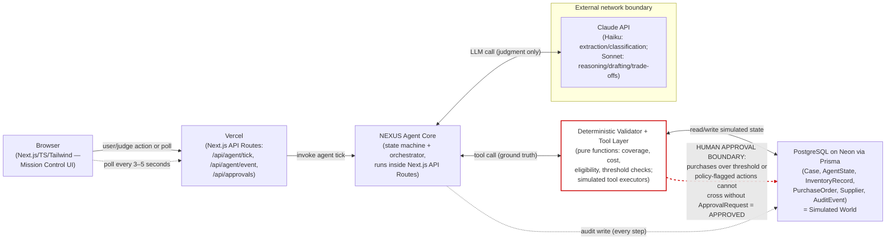
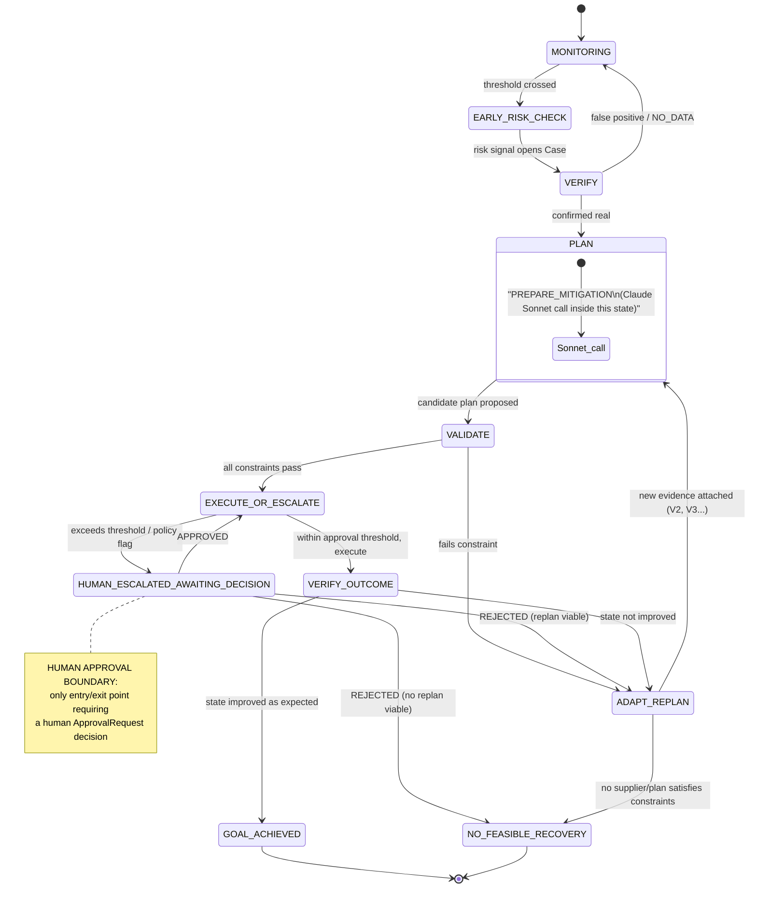
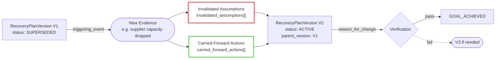
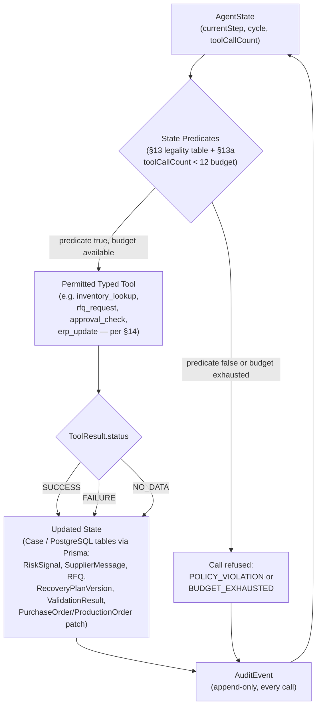
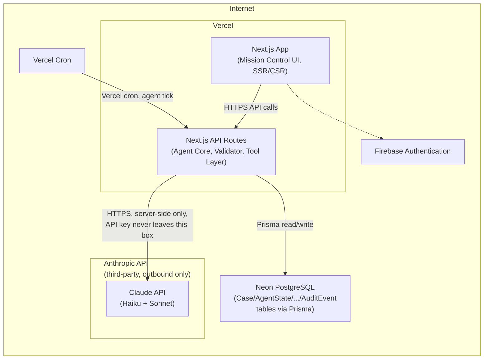

# NEXUS — Autonomous Supply Continuity Control Agent
## Implementation-Grade PRD / SRS
**Team NEXUS — Hackers Occupied Pune 2026, Final Round (Agentic AI Track)**
Build window: 22 Aug 2026 14:00 → 23 Aug 2026 09:00 (19 hours) · Version: **LOCKED-1.2 (FINAL)**

**Changelog v1.0 → v1.1:** (1) added deterministic per-Case tool-call budget, `maxToolCallsPerCase = 12` (§13a); (2) added original-supplier partial-shipment support via a minimal `allocations` field, no new subsystem (§26); (3) renamed `HUMAN_ESCALATED` → `HUMAN_ESCALATED_AWAITING_DECISION` and corrected it to a non-terminal awaiting-human state (§3, §24); (4) `safety_stock_risk` now uses `usableStock`, matching the rest of the system (§19); (5) `required_minimum_coverage` given an exact deterministic definition, no longer left to developer interpretation (§19, §16.1). No architecture, stack, or product-strategy change.

---

## Pre-flight Cross-Check Note

Before drafting, the locked design was checked against the locked Problem Statement (10 required capabilities) and the judging rubric (6 categories). Result: **no contradictions, no missing mandatory requirement.** Every required capability has an explicit architectural owner, and every rubric category is covered by at least two features (see Section 6). No architecture changes are proposed. Proceeding under the locked design.

---

## 1. Executive Summary

NEXUS is a single-agent, tool-using operations controller that protects production continuity when a simulated supply chain is disrupted. It does not chat, and it does not merely display a dashboard: it watches operational signals, decides when a signal is worth investigating, verifies before acting, proposes the smallest safe recovery plan, runs that plan through a deterministic validator before anything executes, executes only what passes, re-reads the world to confirm the action actually worked, and replans statefully (V1 → V2 → …) when it didn't. Humans are looped in only where policy requires approval or where no feasible machine recovery exists. Every step is written to an audit trail sufficient to reconstruct *why* NEXUS did what it did.

The system is built once, correctly, on a locked stack (Next.js/TypeScript/Tailwind, Firebase Authentication, PostgreSQL on Neon via Prisma, Vercel-hosted Next.js API Routes, direct Anthropic Claude API with Haiku/Sonnet routing) with no LangChain, no multi-agent framework, no RAG, no ML forecasting, no MIP solver. The reasoning/judgment surface is the LLM; every number that could sink the company is deterministic code.

## 2. Official Problem Statement Interpretation

The PS asks for an autonomous agent that: monitors a simulated procurement/manufacturing environment, detects risk, talks to suppliers, reasons through trade-offs, replans procurement, updates operational systems, and escalates to humans only when required — while demonstrating multi-step investigation, contextual tool selection, action, verification, uncertainty handling, recovery, replanning, escalation, and an audit trail. NEXUS's interpretation: this is fundamentally a **closed-loop control problem**, not a conversational one. "Agentic" here is judged by whether the system investigates before acting, validates before executing, and verifies after executing — not by how many tools it calls or how eloquent its output is. This interpretation drives every downstream decision in this PRD.

## 3. Product Goal

Given a live simulated procurement/production state and an incoming disruption (or an emerging risk signal), NEXUS must reach one of two true terminal states — `GOAL_ACHIEVED` or `NO_FEASIBLE_RECOVERY` — or the awaiting-human state `HUMAN_ESCALATED_AWAITING_DECISION` (which itself resolves onward to `GOAL_ACHIEVED`, a replan, or `NO_FEASIBLE_RECOVERY`) — via a path that a judge can inspect end-to-end in the audit trail and that never lets an unvalidated or unverified claim pass as fact.

## 4. Non-Goals / Explicitly Excluded Scope

Explicitly out of scope, regardless of how "impressive" they sound, unless a genuine implementation blocker forces a documented deviation (Section 34):

- Multi-agent orchestration / agent-to-agent handoff frameworks
- RAG / vector databases / embeddings
- ML-based demand forecasting or predictive risk scoring
- Blockchain, smart contracts, or any DLT
- MIP/OR-Tools/LP optimization for split-order allocation (greedy/deterministic rule-based split only)
- Real supplier, ERP, payment, or logistics integrations
- LangChain, LangGraph, CrewAI, AutoGPT-style frameworks
- General-purpose chat interface as the primary UX
- Predictive/probabilistic "AI" early-warning claims not grounded in the simulation's actual data
- Authentication beyond a single-tenant judge/team login (no multi-org SaaS features)
- Mobile app, native clients, offline-first sync

## 5. Winning Strategy

1. **Prove control, not conversation.** Every screen answer the question "is production protected?" before anything else.
2. **Make the validator visible.** Judges should see a plan proposed, then see it pass/fail deterministic checks, in real time.
3. **Show a V1→V2 replan live**, with an explicit diff, not just a new plan appearing.
4. **Never let the LLM's opinion masquerade as ground truth.** Every dollar amount, date, and quantity on screen is deterministic-code-derived.
5. **Prefer a smaller system that works under judge-triggered chaos over a larger system that only works on the rehearsed path.**

## 6. Judging Rubric Mapping

| Rubric Category | Weight | Primary NEXUS Features |
|---|---|---|
| Production Continuity | 35% | Deterministic coverage/production calculations (§19), recovery plan validator (§16), outcome verification (§22), Do-Nothing vs NEXUS comparison (§30) |
| Cost Control | 20% | Recovery cost / incremental cost formulas (§19–20), approval thresholds (§21), split-order cost comparison (§18) |
| Supplier Risk Handling | 15% | Supplier evaluation/eligibility (§17), RFQ tool, contradiction handling (Hidden Test 8, §33), reliability scoring |
| Tool Efficiency | 10% | State predicates gating tool legality (§13), NO_DATA/FAILURE semantics (§15), audit log of tool calls vs necessity |
| Recovery/Replanning | 10% | V1→V2 stateful replanning model (§23), termination states (§24) |
| Audit Trail/Explainability | 10% | Full AuditEvent schema (§25–26), Mission Control audit timeline (§28) |

Every MUST-BUILD feature in §39 is traceable to at least one row above.

## 7. User Personas / Actors

- **Ops Controller (human approver):** reviews escalations, approves purchases above threshold, sees the decision brief when no feasible recovery exists.
- **Judge (evaluator):** triggers a disruption event live, watches NEXUS reason and act, reviews audit trail.
- **NEXUS Agent (system actor):** the autonomous controller itself — not a persona but treated as a first-class actor in diagrams.
- **Supplier (simulated actor):** responds to RFQs/messages via simulated, deterministic or LLM-drafted-but-scripted replies; never a real external system.

## 8. End-to-End System Architecture

**FIGURE 1 — System Architecture** (`fig1_system_architecture`)

Purpose: Show the judge the full request/control path from browser to simulated world, and where the human-approval boundary sits. LLM never touches ground truth directly; every fact the agent uses to decide crosses through deterministic code; humans are a hard gate, not a suggestion.



## 9. Agent Architecture

NEXUS is a **single agent**, implemented as an explicit finite-state loop (not a free-running "agent thinks until done" loop) driven from Next.js API Routes. There is no agent-to-agent messaging. The LLM is invoked as a *stateless function call* at specific states only — it receives the current Case + AgentState + relevant tool results as context and returns either (a) a classification/extraction, (b) a proposed plan/action, or (c) drafted communication text. It never has direct write access to PostgreSQL or to any tool; every LLM output is parsed and passed through the Deterministic Validator before it can change state.

Two models, routed by task:
- **Claude Haiku** — supplier-message classification (contradiction detection, sentiment/urgency extraction), simple field extraction from RFQ replies, cheap repeated polling classification.
- **Claude Sonnet** — recovery plan proposal, trade-off reasoning, replanning rationale, supplier communication drafting, escalation brief drafting.

## 10. Agent State Machine

**FIGURE 2 — Agent Execution FSM** (`fig2_agent_execution_loop`)

Purpose: show the exact sequence of states a Case moves through, including the awaiting-human branch and the two true terminal states. Nothing executes without passing `VALIDATE`; nothing is declared successful without `VERIFY_OUTCOME` re-reading real state; replanning is a first-class loop, not a crash-and-restart. `EARLY_RISK_CHECK` is deterministic only (no LLM); `PLAN` is the only state that calls Claude Sonnet.



## 11. Early Risk Monitor

**Not predictive AI.** A deterministic, rule-based trigger source over indicators already present in the simulation.

**Leading indicators** (all deterministic, computed each monitoring cycle):
1. `coverage_days` (see §19) — inventory coverage relative to demand
2. `safety_stock_ratio` = current_stock / safety_stock_threshold
3. `supplier_response_latency` — hours since last supplier message vs SLA
4. `shipment_tracking_inactivity` — hours since last tracking update vs expected cadence
5. `supplier_reliability_score` — rolling on-time/quality performance (0–1, simulation-seeded)
6. `production_deadline_slack` = deadline − (today + estimated_lead_time)

**Trigger rule (locked, deterministic):**
```
EARLY_WARNING opens when:
  (A) two independent indicators from the list above cross their threshold
      in the SAME monitoring cycle, OR
  (B) one indicator remains beyond threshold across >= 2 consecutive
      monitoring cycles.
```
**Thresholds** (defined against simulation data, tune at data-load time, values below are the locked defaults for the shipped simulation):
- `coverage_days < 5` → breach
- `safety_stock_ratio < 1.0` → breach
- `supplier_response_latency > 24h` (SLA-dependent, default 24h) → breach
- `shipment_tracking_inactivity > 18h` → breach
- `supplier_reliability_score < 0.6` → breach
- `production_deadline_slack < lead_time_buffer_days` (default buffer = 2 days) → breach

Early warning MAY: open a Case, investigate (read-only tool calls), verify, contact supplier, request RFQ, shortlist suppliers, prepare (but not submit) a mitigation plan. It MUST NOT bypass §21 approval rules — a prepared mitigation still goes through VALIDATE and, if it crosses the approval threshold, still routes to `HUMAN_ESCALATED_AWAITING_DECISION` rather than auto-executing early.

Threshold evidence is persisted on the `Case.riskSignals[]` array (see `RiskSignal` schema, §26) with the exact indicator, value, threshold, and cycle timestamp — this is what the audit trail shows a judge to prove the trigger wasn't hand-waved.


## 12. VERIFY → CONTROL → ADAPT Loop

- **VERIFY**: confirm the risk/disruption is real using at least one independent tool call beyond the triggering signal (e.g., an inventory-lookup breach is verified against a fresh ERP read; a supplier-delay claim is verified against tracking data). If verification returns `NO_DATA`, the Case stays open but does not advance to PLAN — it re-checks next cycle (max 3 cycles before auto-escalating as "unverifiable risk").
- **CONTROL** (PLAN → VALIDATE → EXECUTE_OR_ESCALATE): the LLM (Sonnet) proposes one or more candidate RecoveryPlans; every candidate is run through the Deterministic Validator (§16); only a plan that fully passes may be executed, and only if it is within the approval threshold — otherwise it is packaged into an ApprovalRequest.
- **ADAPT**: after execution, VERIFY_OUTCOME re-reads state. If the operational goal is not achieved, the Case is versioned (V1→V2 per §23) and returned to PLAN with the new evidence attached, not restarted from scratch.

## 13. Tool Selection Logic

Tool calls are gated by explicit state predicates — not "the LLM decides to call whatever." This directly supports the Tool Efficiency rubric line (10%): every tool call in the audit log must map to a predicate below, and unnecessary calls are a scored negative.

| Tool | Legal only when predicate is true |
|---|---|
| `inventory_lookup` | Case is in `EARLY_RISK_CHECK` or `VERIFY`, AND no inventory read exists for this Case in the current cycle |
| `purchase_order_lookup` | Case is in `EARLY_RISK_CHECK` or `VERIFY` AND the Case references an open PO whose status/fields haven't been read this cycle |
| `production_schedule_lookup` | Case references a `productionOrderId` AND deadline/coverage fields are stale (>1 cycle old) |
| `shipment_tracking_lookup` | a supplier claim references an in-transit PO, OR `shipment_tracking_inactivity` indicator fired |
| `supplier_message_send` | Case is `VERIFY` or later AND the disruption/risk involves a specific `supplierId` AND no outbound message sent this cycle for that Case |
| `rfq_request` | Case has entered `PLAN` AND current suppliers cannot fully cover requirement AND (no open RFQ exists for this Case OR the existing RFQ's responses have exceeded `quoteValidHours`) |
| `supplier_eligibility_check` | a candidate supplier is being scored inside `PLAN` (always required before that supplier can appear in a RecoveryPlan) |
| `approval_check` | Case has a `VALIDATE`-passed plan and is entering `EXECUTE_OR_ESCALATE`, exactly once per plan version |
| `erp_update` (ERP write) | Case is in `EXECUTE_OR_ESCALATE` AND the plan has passed `VALIDATE` AND `approval_check` returned `approvalRequired: false` (OR an `ApprovalRequest` is `APPROVED`); `erp_update` also covers `scheduleAdjustment` writes when the plan includes one |
| `escalation_create` | `VALIDATE` fails for all candidate plans, OR `approval_check` returns `approvalRequired: true`, OR replanning has occurred ≥ 3 times with no passing plan |
| `outcome_reread` | immediately and only after `erp_update` (or equivalent execution tool) returns `SUCCESS` |

Any tool call outside its predicate is logged as a **policy violation** in AuditEvent (for internal testing/scoring, not exposed as a user-facing error) — this lets the team self-verify tool efficiency before the demo.

### 13a. Tool-Call Budget (Resource Constraint, Not a New Architecture Layer)

Per PS §6 ("Tool calls may be limited"): every Case tracks `AgentState.toolCallCount`, a running total across the entire Case lifetime (all cycles, all replans) — not reset per cycle and not reset on V1→V2. `maxToolCallsPerCase = 12`.

- Every actual tool invocation (§14) increments `toolCallCount` by 1, regardless of `SUCCESS`/`FAILURE`/`NO_DATA` outcome.
- Enforcement sits as one extra guard evaluated alongside the existing state predicates (§13 table) — not a separate subsystem: before any tool call fires, check `toolCallCount < maxToolCallsPerCase`. If false, the call is refused and logged as `BUDGET_EXHAUSTED` (distinct from `POLICY_VIOLATION`).
- The LLM never sees or controls this counter directly — it cannot "decide" to exceed it; the guard is deterministic code wrapping every tool dispatch.
- On exhaustion, the agent must not stall. It resolves via, in order: (a) if a `VALIDATE`-passed plan already exists, proceed to `EXECUTE_OR_ESCALATE` with it; (b) else if a final validation/execution step is still legally reachable without a new tool call (e.g. re-checking an already-fetched RFQ), take it; (c) else `escalation_create` with reason `TOOL_BUDGET_EXHAUSTED` and a decision brief built from whatever evidence was gathered.
- **Budget exhaustion never causes execution of an invalid plan** — it can only route to (a) a plan that already passed the Validator, or (c) escalation. It cannot bypass `VALIDATE`.
- `toolCallCount` is surfaced in Mission Control's tool-efficiency panel (§28) and in the audit trail (`AuditEvent.detail.toolCallCount` on every `TOOL_CALL` event), making it directly visible for the Tool Efficiency rubric line (10%).

## 14. Tool Contracts

All tools are pure, typed functions (simulated executors over PostgreSQL/simulation fixtures). Contract shape is identical for every tool:

```typescript
interface ToolCall<TInput> {
  toolName: string;
  input: TInput;
  caseId: string;
  invokedBy: 'AGENT' | 'HUMAN';
  cycle: number;
}

interface ToolResult<TOutput> {
  status: 'SUCCESS' | 'FAILURE' | 'NO_DATA';
  data?: TOutput;          // present only when status === 'SUCCESS'
  errorReason?: string;    // present when FAILURE
  staleness?: 'FRESH' | 'STALE'; // present when NO_DATA or on reads, e.g. stale ERP test
  latencyMs: number;
}
```

Concrete tools (aligned 1:1 with the organizer's suggested API list, PS §16, plus internal composites):
- `inventory_lookup(sku, warehouseId) -> InventoryRecord` — maps to `GET /inventory/{component_id}`
- `purchase_order_lookup(poId?) -> PurchaseOrder | PurchaseOrder[]` — maps to `GET /purchase-orders[/{po_id}]`; NEW, closes a gap where open-PO status (PS §4.1 "open purchase orders") had no dedicated read tool
- `production_schedule_lookup(productionOrderId) -> ProductionOrder` — maps to `GET /production-schedule`
- `shipment_tracking_lookup(poId) -> { lastEvent, lastEventAt, status }` — maps to `GET /tracking/{po_id}`
- `supplier_eligibility_check(supplierId, sku, qty) -> { eligible, reasons[] }` — maps to `GET /suppliers?component_id=...`, filtered/scored deterministically
- `rfq_request(supplierIds[], sku, qty, neededBy) -> RFQ` — maps to `POST /rfq`
- `supplier_message_send(supplierId, subject, body, caseId) -> SupplierMessage` — maps to `POST /suppliers/{supplier_id}/message`
- `supplier_message_poll(supplierId) -> SupplierMessage[]` (simulated inbox read, PS §5.5)
- `approval_check(caseId, estimatedCost) -> { approvalRequired: boolean, approvalReason: string }` — maps to `POST /approval/check`; NEW, makes the approval decision a discrete auditable tool call (§21) rather than only an implicit Validator check
- `erp_update(poId or productionOrderId, patch) -> { applied: boolean }` — maps to `POST /erp/update`; `patch` may include a `scheduleAdjustment` (delay a lower-priority production order, PS Scenario 6) in addition to sourcing-related fields
- `escalation_create(caseId, brief) -> ApprovalRequest`
- `outcome_reread(caseId) -> { inventory, production, orders }` (composite re-read)

## 15. Tool Failure Semantics

**Never treat tool failure as operational truth.** Explicit handling per outcome:

- **Tool returns `FAILURE`**: the calling state does NOT advance. The Case logs the failure, retries once (bounded, exponential-ish backoff simulated as next cycle), and if it fails twice, the state either (a) falls back to a different tool/path if one exists (e.g., tracking failed → ask supplier directly), or (b) opens an escalation with reason `TOOL_UNAVAILABLE`.
- **Tool returns `NO_DATA`**: treated as *absence of evidence*, not *evidence of absence*. The Case cannot use NO_DATA to justify VERIFY passing or a plan passing VALIDATE. It stays in place, re-attempts next cycle, capped at 3 cycles, after which it escalates as `UNVERIFIABLE`.
- **LLM proposes an invalid action** (e.g., a plan referencing a non-eligible supplier, a quantity that doesn't add up, a supplier not returned by `supplier_eligibility_check`): the Deterministic Validator rejects it outright — it is never executed — and the rejection reason is fed back to the LLM as new context for one re-proposal attempt (max 2 re-proposals per plan cycle) before the Case escalates as `NO_VALID_PLAN_PROPOSED`.
- **All suppliers fail constraints**: Case moves directly to `NO_FEASIBLE_RECOVERY` after generating a decision brief (§24) — NEXUS never forces an ineligible supplier into a plan to "complete" the demo.
- **Execution succeeds but state doesn't improve**: `outcome_reread` shows the operational goal still unmet → automatic replan (V1→V2), NOT treated as success (Hidden Test 12).
- **Supplier claim contradicts tracking**: both are logged as competing `RiskSignal`/evidence; the Deterministic Validator treats tracking data as higher-trust ground truth by default (config: `trustOrder = ['tracking', 'erp', 'supplierMessage']`), but the contradiction itself is surfaced in the Case and audit trail rather than silently resolved (Hidden Test 8).
- **Inventory changes during planning** (stale read mid-plan): before `EXECUTE_OR_ESCALATE`, the validator always does a final freshness check — if the inventory read used to build the plan is older than 1 cycle, it forces one `inventory_lookup` refresh before allowing execution (Hidden Test 2, 11).
- **Multiple disruptions arrive together**: see §24/§33 — highest production-impact Case is processed first; others are queued with state `QUEUED` and processed in impact order once the current Case reaches a terminal or awaiting-approval state.

## 16. Deterministic Validator

The validator is a **hard execution boundary** — pure, deterministic TypeScript, no LLM call inside it, unit-testable in isolation. It runs on every candidate `RecoveryPlan` before `EXECUTE_OR_ESCALATE` is entered.

Checks performed, in order (short-circuits on first failure, all failures recorded, not just the first):
1. **Coverage check** — does executing this plan satisfy `required_minimum_coverage` (§19) — i.e., does projected coverage stay above the safety-stock floor at every point through the deadline AND meet full `production_requirement` by the deadline?
2. **Deadline check** — does `neededBy` (RFQ/supplier delivery date) satisfy `production_deadline_slack ≥ 0` after this plan?
3. **MOQ check** — does each supplier allocation meet that supplier's minimum order quantity?
4. **Certification check** — does each supplier hold required certification(s) for the SKU?
5. **Budget check** — is total plan cost ≤ `EmergencyBudget.remainingAmount` (the shared session-level pool, §26), not just a per-Case allowance?
6. **Split-allocation check** — for multi-supplier plans, does each independent allocation pass checks 1–5 on its own slice, and does the sum of allocations meet or exceed the required quantity?
7. **Freshness check** — is every fact used in the plan (inventory, tracking, eligibility) from the current or immediately-previous cycle?
8. **Approval-threshold check** — is total plan cost ≤ `approvalThreshold`? (Determines EXECUTE vs ESCALATE branch, not pass/fail of the plan itself.)

Output: `ValidationResult` (schema §26) listing every check with pass/fail and the numeric values used, so the audit trail shows the judge exactly why a plan was accepted or rejected — not just "invalid."

## 17. Supplier Evaluation

`supplier_eligibility_check(supplierId, sku, qty)` evaluates, deterministically:
- Certification match for the SKU
- MOQ ≤ requested qty ≤ max capacity for this cycle
- `reliabilityScore ≥ minReliabilityForCase` (default 0.5; raised to 0.7 for cases where production deadline slack < 1 day)
- `qualityScore ≥ minQualityForCase` (default 0.7; this is the explicit, separate check that rejects a cheap-but-low-quality supplier even when reliability and certification both pass — PS Scenario 4 / Hidden Test 3, "cheapest supplier fails quality requirements")
- No open contradiction flag (tracking vs supplier claim) unresolved for this supplier in this Case
- Lead time (from RFQ or historical default) + today ≤ required `neededBy`

RFQ evaluation (once replies arrive) scores each responding supplier on: price, lead time, reliability score, quality score, capacity offered — combined via a simple weighted deterministic score (no ML): `score = 0.3*normalizedPriceInverse + 0.25*reliability + 0.2*quality + 0.15*normalizedLeadTimeInverse + 0.1*capacityFitRatio`. This score is a *ranking aid for the LLM's plan proposal*, not a black-box decision — the LLM still proposes the plan, but candidate suppliers it may choose from are pre-filtered to only eligible ones (i.e., already passed the quality/reliability/certification gates above, not just weighted into a single fuzzy score).

## 18. Split/Partial Fulfillment

In scope, as locked. Rule-based, not MIP:
- If no single eligible supplier can cover the full requirement, the agent may propose a plan with 2 (max 3, to keep validation and audit tractable in the time budget) supplier allocations.
- **Split allocation validation**: each allocation is validated independently against the full Deterministic Validator checklist (§16) on its own slice of quantity/cost/deadline; the plan as a whole additionally requires `sum(allocations.qty) >= requiredQty` and `sum(allocations.cost) <= EmergencyBudget.remainingAmount`.
- Preference order when multiple valid splits exist: minimize supplier count first (fewer allocations = lower coordination risk), then minimize total cost, then minimize max single-supplier lead time. This preference order is deterministic and documented so the LLM's proposal can be checked against it, not left to LLM taste.
- **Non-sourcing lever (production reschedule):** per PS Scenario 6 and the organizer's canonical example output, a valid recovery plan may include `scheduleAdjustments` (§26) — delaying a lower-priority `ProductionOrder` — as a substitute or complement to supplier sourcing when it reduces cost/risk with no continuity impact on the delayed order. The Validator applies the same deadline-safety check (§16.2) to the *delayed* order's new deadline before accepting this as part of a plan.

## 19. Inventory + Production Calculations

All formulas are deterministic TypeScript, unit-tested, and are the only source of numbers shown to the user or used in `VALIDATE`.

**coverage_days**
- Inputs: `usableStock` (NOT `currentStock` — see §26a; `currentStock` is the ERP-reported figure and may be stale/wrong per PS Scenario 2), `dailyUsageRate`
- Output: `coverage_days = usableStock / dailyUsageRate`
- Edge cases: `dailyUsageRate === 0` → return `Infinity` (no consumption risk); `usableStock < 0` (data bug) → clamp to 0 and flag `NO_DATA`/data-integrity RiskSignal; `|currentStock - usableStock| > 0` → raise `stockDiscrepancyFlag`, log a `RiskSignal` (source: `'erp'` vs `'inventory'` contradiction), and treat as risk-severity-increasing evidence even if `usableStock` alone doesn't breach threshold (this is the exact mechanism for Hidden Test 2 / PS Scenario 2)
- Example: `currentStock`=800 (ERP), `usableStock`=390 (warehouse-confirmed), usage=90/day → `coverage_days = 4.3` (using usableStock, not the ERP figure's 8.9)

**production_requirement**
- Inputs: `productionOrder.plannedQty`, `bomQtyPerUnit` (units of the SKU needed per finished unit)
- Output: `production_requirement = plannedQty * bomQtyPerUnit`
- Edge cases: missing BOM ratio → `NO_DATA`, do not assume 1:1
- Example: plannedQty=500 units, bomQtyPerUnit=2 → requirement = 1000

**deadline_risk (production_deadline_slack)**
- Inputs: `deadlineDate`, `today`, `estimatedLeadTimeDays` (procurement + production lead time)
- Output: `slack_days = (deadlineDate - today) - estimatedLeadTimeDays`
- Edge cases: `estimatedLeadTimeDays` unknown (no RFQ yet) → use supplier default lead time from `Supplier.defaultLeadTimeDays`; if still unknown → `NO_DATA`
- Example: deadline in 10 days, lead time 6 days → slack = 4 (safe); if lead time 12 days → slack = -2 (breach)

**safety_stock_risk**
- Inputs: `usableStock` (ground-truth; falls back to `currentStock` only if `usableStock` is genuinely unavailable — never the reverse), `safetyStockThreshold`
- Output: `ratio = usableStock / safetyStockThreshold` (breach if < 1.0)
- Edge cases: `safetyStockThreshold === 0` → indicator disabled for that SKU (log, don't crash)
- Example: usableStock=300, threshold=500 → ratio=0.6 → breach

**required_minimum_coverage (feeds Validator check §16.1)**
- Definition, made explicit and deterministic (not left to developer interpretation): a candidate plan passes the coverage check only if, after execution, projected `coverage_days` at every day between today and `deadlineDate` stays ≥ `max(safetyStockThreshold / dailyUsageRate, daysUntilDeadline)` where `daysUntilDeadline = deadlineDate − today`. In plain terms: usable stock plus the plan's incoming quantity must (a) never dip below the days-equivalent of `safetyStockThreshold` at current usage rate, AND (b) fully cover `production_requirement` (§19) by the deadline.
- Inputs: `usableStock`, incoming plan quantity + its expected arrival date, `dailyUsageRate`, `safetyStockThreshold`, `production_requirement`, `deadlineDate`
- Output: boolean `coverageSufficient` + numeric `projectedCoverageDaysAtDeadline`
- Edge case: if the plan's incoming quantity arrives after `deadlineDate`, `coverageSufficient` is automatically false regardless of quantity (deadline check §16.2 catches this independently too — both must pass)
- Example: usableStock=390, dailyUsageRate=90, safetyStockThreshold=150 (→1.67 safety days), deadline in 8 days, production_requirement=700 units, plan delivers 600 units on day 4 → projected stock never breaches safety floor and totals ≥700 by day 8 → `coverageSufficient = true`

**recovery_cost**
- Inputs: for each allocation: `unitPrice`, `qty`, `expediteFeeIfAny`, `shippingCost`
- Output: `recovery_cost = Σ (unitPrice*qty + expediteFeeIfAny + shippingCost)` across allocations
- Edge case: expedite unavailable → that candidate is dropped, not silently priced at 0
- Example: 400 units @ ₹250 + ₹5,000 expedite = ₹1,05,000

**incremental_cost**
- Inputs: `recovery_cost`, `plannedBaselineCost` (original PO cost for the same qty at original terms)
- Output: `incremental_cost = recovery_cost - plannedBaselineCost`
- Edge case: negative incremental cost (recovery is cheaper) is valid and reported, not floored at 0
- Example: baseline ₹90,000, recovery ₹1,05,000 → incremental = ₹15,000

**continuity_impact**
- Inputs: `production_requirement`, projected `coverage_days` if no action taken, `deadline_risk` if no action taken
- Output: qualitative+quantitative — `unitsAtRisk = max(0, production_requirement - projectedAvailableStock)`, plus boolean `deadlineBreached`
- Example: 1000 required, 700 projected available → unitsAtRisk = 300

**supplier_eligibility** — see §17 (boolean + reasons[])

**approval_threshold** — see §21

**split_allocation_validation** — see §18 (independent per-allocation validator pass + aggregate sum check)

## 20. Cost / Continuity Decision Logic

When multiple valid plans exist, ranking order (deterministic, not LLM-chosen) is: (1) any plan that fully prevents `deadlineBreached` beats any plan that doesn't; (2) among those, lowest `incremental_cost`; (3) tie-break by lowest supplier count; (4) tie-break by highest average `(reliabilityScore + qualityScore) / 2` across allocations. The LLM proposes candidates and drafts the human-readable rationale; the ranking itself is computed by deterministic code so it can't be gamed by prompt phrasing.

## 21. Approval / Human-in-the-Loop

**Corrected against PS §5.8 (Budget and Approval Tool) and §5.2 (`approval_required_above` on the PurchaseOrder record):** the primary, sandbox-authoritative check is on the plan's **absolute estimated cost**, mirroring the organizer's `POST /approval/check`-style semantics (`estimated_cost` vs a threshold, returning `approval_required` + `approval_reason`) — not an incremental-delta rule invented independently of the sandbox. `incremental_cost` (§19) is still computed and shown (it's the right number for the Cost Control KPI and the Do-Nothing-vs-NEXUS comparison, §30) but it does **not** gate the approval decision.

- `approvalThreshold` is read per-order from the sandbox's `approval_required_above` field when present (PS §5.2 example: 150,000); falls back to a configured session default only if the sandbox record omits it.
- A dedicated `approval_check` tool call (§14) — matching the organizer's named `POST /approval/check` tool — is invoked in `EXECUTE_OR_ESCALATE` and produces a deterministic `{ approvalRequired: boolean, approvalReason: string }` result, which is written to `AuditEvent` as its own step (mirroring the PS's canonical example output: *"Checked approval requirement. Total cost requires manager approval."*). This is in addition to, not instead of, the Validator's own threshold check (§16.8) — the tool call is what makes the check visible/auditable as a discrete action, the Validator is what makes it a hard gate.
- Auto-execute requires ALL of: `estimatedCost ≤ approvalThreshold` AND `estimatedCost ≤ EmergencyBudget.remainingAmount` AND no policy flag (new/unvetted supplier, or `productionOrder.priority: CRITICAL`).
- Else → `escalation_create` produces an `ApprovalRequest` with the plan, validator results, the deterministic `approvalReason`, and a Sonnet-drafted decision brief; Case state becomes `HUMAN_ESCALATED_AWAITING_DECISION` (awaiting-approval, not necessarily terminal — approval resolves back into `EXECUTE_OR_ESCALATE`).
- A human approving/rejecting via Mission Control is itself an audited action (`AuditEvent` with `actor: 'HUMAN'`), and on approval, `EmergencyBudget.reservedAmount` moves to `spentAmount`.

## 22. Outcome Verification

Immediately after any execution tool returns `SUCCESS`, `outcome_reread` re-reads the actual simulated state (inventory, production order, PO status) — the plan is never marked achieved based on the execution API's return value alone (this is the direct fix for Hidden Test 12). Verification checks: does `coverage_days` now meet the required minimum; is `deadlineBreached` now false; does the PO/production order reflect the expected new quantities/dates. If yes → `GOAL_ACHIEVED`. If no → automatic replan trigger into `ADAPT_REPLAN` with the reread state attached as new evidence.

## 23. V1 → V2 Replanning

**FIGURE 3 — V1 → V2 Replanning Lineage** (`fig3_v1_v2_replanning`)

Purpose: show a judge, at a glance, that replanning preserves state rather than restarting. V2 is not a fresh plan — it explicitly states what from V1 is still trusted (`carried_forward_actions`) and what's been thrown out (`invalidated_assumptions`), with a named reason. V1's status flips `ACTIVE` → `SUPERSEDED` the instant V2 is created; V2 starts `ACTIVE`.



**Data model (locked fields, see `RecoveryPlanVersion` schema §26):** every version stores `parent_version`, `invalidated_assumptions: string[]`, `carried_forward_actions: string[]`, `reason_for_change: string`, `triggering_event: RiskSignal | ToolResult reference`. V2 generation prompt to Sonnet explicitly includes V1's full plan plus the new evidence and asks it to state, per field, what changes and what doesn't — the Deterministic Validator then re-validates V2 from scratch (no field is trusted just because it was "carried forward" without re-check, except values that are provably unaffected, e.g. an already-fulfilled partial allocation).

## 24. Case Lifecycle / Termination

States: `OPEN → MONITORING → EARLY_RISK_CHECK → VERIFY → PLAN → VALIDATE → EXECUTE_OR_ESCALATE → VERIFY_OUTCOME → ADAPT_REPLAN (loop) → { GOAL_ACHIEVED | HUMAN_ESCALATED_AWAITING_DECISION | NO_FEASIBLE_RECOVERY }`, plus `QUEUED` for cases waiting behind a higher-impact one.

- `GOAL_ACHIEVED`: outcome verification confirms the operational goal is met.
- `HUMAN_ESCALATED_AWAITING_DECISION`: **not terminal.** An awaiting-human state. `APPROVED` → returns to the controlled execution path (`EXECUTE_OR_ESCALATE` → execute → `VERIFY_OUTCOME`). `REJECTED` → routes to `ADAPT_REPLAN` (if a replan is still viable) or `NO_FEASIBLE_RECOVERY` (if not).
- `NO_FEASIBLE_RECOVERY`: no candidate plan passes VALIDATE after the bounded replanning attempts (default cap: 3 replans), or all eligible suppliers are exhausted. NEXUS never forces an invalid plan through — it produces a **decision brief** (constraints hit, suppliers tried and why each failed, closest-miss plan, recommended human next step) and stops there.

**Simultaneous disruptions (Hidden Test 13):** each new disruption event opens or attaches to a Case; Cases are ranked by `continuity_impact.unitsAtRisk` (ties broken by `deadline_risk` slack, most urgent first). The agent processes exactly one Case through the full loop per Next.js API route invocation cycle at a time; others sit `QUEUED` and are visibly ordered in Mission Control so the judge can see the queue, not just a spinner.

## 25. Audit Trail

Every state transition, every tool call (with input/output/status), every LLM invocation (prompt summary + output summary, not full raw prompt), every validator run, and every human action is appended as an immutable `AuditEvent` (PostgreSQL, append-only table, never updated/deleted). The audit trail is the single source the Mission Control "timeline" view renders from — nothing shown in the UI is allowed to exist without a corresponding AuditEvent, ensuring the explainability rubric line is provably satisfied, not just claimed.

## 26. PostgreSQL Data Model

```typescript
interface Case {
  id: string;
  productionOrderId: string;
  status: 'OPEN' | 'MONITORING' | 'EARLY_RISK_CHECK' | 'VERIFY' | 'PLAN' |
          'VALIDATE' | 'EXECUTE_OR_ESCALATE' | 'VERIFY_OUTCOME' | 'ADAPT_REPLAN' |
          'QUEUED' | 'GOAL_ACHIEVED' | 'HUMAN_ESCALATED_AWAITING_DECISION' | 'NO_FEASIBLE_RECOVERY';
  priority: 'STANDARD' | 'CRITICAL';
  riskSignals: RiskSignal[];
  activePlanVersion: number;      // points into RecoveryPlanVersion[]
  replanCount: number;
  continuityImpact: { unitsAtRisk: number; deadlineBreached: boolean };
  createdAt: string; updatedAt: string;
  queuedBehindCaseId?: string;    // set if QUEUED
}

interface AgentState {
  caseId: string;
  currentStep: Case['status'];
  cycle: number;
  lastToolCalls: string[];        // toolNames this cycle, for tool-efficiency self-audit
  toolCallCount: number;          // cumulative tool calls for the ENTIRE Case (not per-cycle);
                                    // hard cap maxToolCallsPerCase = 12 (§13a)
  lastLlmModel?: 'haiku' | 'sonnet';
  pendingLlmTask?: string;
  updatedAt: string;
}

interface ProductionOrder {
  id: string; sku: string; plannedQty: number; bomQtyPerUnit: number;
  deadlineDate: string; priority: 'STANDARD' | 'CRITICAL'; status: string;
}

interface InventoryRecord {
  sku: string; warehouseId: string;
  currentStock: number;   // ERP-reported figure (may be stale/wrong — PS Scenario 2)
  usableStock: number;    // ground-truth warehouse-confirmed usable qty; ALL coverage
                           // math uses this field, never currentStock, once available
  dailyUsageRate: number; safetyStockThreshold: number;
  lastUpdatedAt: string; // used for freshness / stale-ERP tests
  stockDiscrepancyFlag?: boolean; // true when |currentStock - usableStock| > 0, drives Hidden Test 2
}

interface PurchaseOrder {
  id: string; supplierId: string; sku: string; qty: number; unitPrice: number;
  status: 'DRAFT' | 'SENT' | 'CONFIRMED' | 'DELAYED' | 'FULFILLED' | 'CANCELLED';
  expectedDeliveryDate: string; caseId?: string;
}

interface Supplier {
  id: string; name: string; certifications: string[];
  moq: number; maxCapacityPerCycle: number; defaultLeadTimeDays: number;
  reliabilityScore: number; // 0-1, on-time/consistency track record
  qualityScore: number;     // 0-1, distinct from reliability per PS §5.3 (e.g. defect/cert-adjacent
                              // quality rating) — required rubric dimension: "Supplier Risk Handling:
                              // reliability, quality, contradictions"
  pricePerUnit: Record<string, number>; // sku -> price
}

interface SupplierMessage {
  id: string; supplierId: string; caseId: string; direction: 'OUTBOUND' | 'INBOUND';
  subject: string; body: string; extractedFields?: Record<string, unknown>;
  contradictionFlag?: boolean; sentAt: string;
}

interface RFQ {
  id: string; caseId: string; sku: string; qty: number; neededBy: string;
  supplierIds: string[]; status: 'OPEN' | 'CLOSED';
  responses: {
    supplierId: string; price: number; leadTimeDays: number; capacityOffered: number;
    expediteAvailable?: boolean; expediteFee?: number;
    quoteValidHours: number;      // per PS §5.7 — quote expires; Validator freshness
    quoteReceivedAt: string;       // check (§16.7) treats an expired quote as STALE, forcing
  }[];                              // a fresh rfq_request before that response can be used
}

interface RecoveryPlan {
  id: string; caseId: string; versionId: string;
  allocations: {
    supplierId: string; qty: number; unitPrice: number; expediteFee?: number;
    isOriginalSupplierPartial?: boolean; // true when this allocation is a PARTIAL fulfillment
    // from the SAME supplier as the original disrupted PO (PS: "ask for partial shipment
    // availability") — reuses the existing allocation/validation machinery unchanged; the
    // remaining shortage is simply another allocation (different supplier) or a
    // scheduleAdjustment in the same plan. No new subsystem, no new plan type.
  }[];
  totalCost: number; expectedDeliveryDate: string;
  // Non-sourcing recovery action, modeled explicitly per PS's canonical example output
  // ("delay low-priority PROD-914 by 2 days") and Scenario 6 — a plan may include this
  // instead of, or alongside, supplier allocations:
  scheduleAdjustments?: {
    productionOrderId: string;
    action: 'DELAY';
    originalDeadline: string;
    newDeadline: string;
    justification: string; // why this order is safe to delay (priority, slack)
  }[];
}

interface EmergencyBudget {
  // Single shared pool per PS §6: "Total emergency procurement budget is limited."
  // One document for the whole session; every candidate plan's cost is checked against
  // remainingAmount, and every EXECUTED plan decrements it. Contended directly under
  // Hidden Test 13 (simultaneous disruptions) — Cases are ranked by impact (§24) and the
  // higher-impact Case reserves budget first; a lower-impact QUEUED Case may find
  // insufficient remaining budget and route to HUMAN_ESCALATED_AWAITING_DECISION or NO_FEASIBLE_RECOVERY.
  totalAmount: number;
  reservedAmount: number;   // sum of PENDING ApprovalRequest plan costs
  spentAmount: number;      // sum of EXECUTED plan costs
  remainingAmount: number;  // totalAmount - reservedAmount - spentAmount, recomputed on write
  updatedAt: string;
}

interface RecoveryPlanVersion {
  version: number; caseId: string; parent_version: number | null;
  plan: RecoveryPlan;
  invalidated_assumptions: string[];
  carried_forward_actions: string[];
  reason_for_change: string;
  triggering_event: string;    // AuditEvent id or RiskSignal id
  status: 'ACTIVE' | 'SUPERSEDED';
  createdAt: string;
}

interface ValidationResult {
  planVersionId: string;
  checks: { name: string; passed: boolean; expected: number | string; actual: number | string }[];
  overallPassed: boolean;
  withinApprovalThreshold: boolean;
}

interface ApprovalRequest {
  id: string; caseId: string; planVersionId: string;
  brief: string; // Sonnet-drafted decision brief
  status: 'PENDING' | 'APPROVED' | 'REJECTED';
  resolvedBy?: string; resolvedAt?: string;
}

interface AuditEvent {
  id: string; caseId: string; cycle: number; timestamp: string;
  actor: 'AGENT' | 'HUMAN' | 'SYSTEM';
  type: 'STATE_TRANSITION' | 'TOOL_CALL' | 'LLM_CALL' | 'VALIDATION' | 'HUMAN_ACTION';
  summary: string;
  detail: Record<string, unknown>; // typed by `type`
}

interface ToolResult<T = unknown> {
  toolName: string; status: 'SUCCESS' | 'FAILURE' | 'NO_DATA';
  data?: T; errorReason?: string; staleness?: 'FRESH' | 'STALE'; latencyMs: number;
}

interface RiskSignal {
  id: string; caseId: string; indicator: string; // e.g. 'coverage_days'
  value: number; threshold: number; cycle: number; timestamp: string;
  source: 'inventory' | 'tracking' | 'supplierMessage' | 'erp';
}
```

## 26a. Sandbox Field Mapping / Data Ingestion Layer

The organizer's sandbox (PS §5) uses snake_case field names (`component_id`, `po_id`, `supplier_id`, `production_order_id`, `available_quantity`, `quality_score`, `approval_required_above`, etc.). NEXUS's internal Prisma model (§26) is camelCase and uses `sku`/`id` in place of `component_id`/`po_id`. A single, explicit ingestion adapter — not scattered ad hoc renaming — sits at the boundary where sandbox data is first read:

```typescript
// One mapping module, called at seed time and at every raw sandbox read.
// Never let organizer field names leak past this boundary.
function mapInventoryRecord(raw: SandboxInventory): InventoryRecord {
  return {
    sku: raw.component_id,
    warehouseId: raw.warehouse,
    currentStock: raw.current_stock,
    usableStock: raw.usable_stock ?? raw.current_stock, // fallback if sandbox omits it
    dailyUsageRate: raw.daily_usage,
    safetyStockThreshold: raw.safety_stock,
    lastUpdatedAt: raw.last_updated,
  };
}
// Equivalent mapSupplier, mapPurchaseOrder, mapProductionOrder, mapRfqResponse functions.
```

This is a MUST-BUILD item (add to §39) — without it, every downstream formula (§19) silently operates on `undefined` fields the moment real sandbox data is loaded instead of hand-written fixtures.

## 27. Next.js API Routes / Backend APIs

**FIGURE 5 — Data / Tool Flow** (`fig5_data_tool_flow`)

Purpose: show, per agent state, exactly how a tool call is authorized and how its result flows back into state — no state calls a tool it isn't allowed to per §13/§13a, and every call writes at least one AuditEvent.



At `VALIDATE`, the outcome of the Validator (itself a deterministic "tool" in this flow) branches the FSM to `EXECUTE_OR_ESCALATE` (pass) or back to `PLAN` (fail, re-propose) — see Figure 2.

REST-style endpoints (Next.js API Routes on Vercel):
- `POST /api/agent/tick` — invoked by Vercel Cron (e.g. every 20–30s during demo) or manually; advances all `OPEN`/in-progress Cases one step.
- `POST /api/agent/event` — judge-triggered disruption injector; body: `{ type: 'SUPPLIER_CAPACITY_DROP' | 'SHIPMENT_DELAY' | 'DEMAND_SPIKE', payload }`; creates/attaches to a Case and immediately runs one tick.
- `GET /api/cases/:id` — full Case + latest AgentState + active RecoveryPlanVersion + AuditEvents (paginated).
- `POST /api/approvals/:id/resolve` — human approve/reject; body `{ decision, resolvedBy }`; writes `ApprovalRequest` + `AuditEvent(actor: HUMAN)`.
- `GET /api/dashboard/summary` — aggregate KPIs for Mission Control top bar (§29).

Auth: Firebase Authentication, single role sufficient for the hackathon (`OPS_CONTROLLER`), gating `/api/approvals/*` writes only; reads are open within the authenticated session for demo simplicity.

## 28. Frontend Mission Control

Primary visual story: **"Is production protected?"** — never a generic analytics dashboard.

Layout (single-page, refreshed by API polling every 3–5 seconds):
- **Top status bar** (always visible): Current Goal, Coverage Remaining, Production Status (protected/at-risk/breached), Current Risk level.
- **Left panel — Case list**: Orders at Risk, Deadline Risk, sorted by continuity impact; `QUEUED` cases visibly stacked below the active one.
- **Center panel — Live agent trace**: current operational step (highlighted node from Figure 2's state machine, rendered live), active tool calls streaming in with SUCCESS/FAILURE/NO_DATA badges.
- **Right panel — Plan & Validator**: candidate RecoveryPlan(s), Validator checklist (§16) rendered as pass/fail rows with actual numbers, Do-Nothing vs NEXUS Plan comparison (§30).
- **Bottom drawer — V1→V2 diff and Audit timeline**: expandable, shows the Figure-3-style lineage for the active Case, and the full chronological AuditEvent feed.
- **Escalation modal**: when a Case is `HUMAN_ESCALATED_AWAITING_DECISION`, a blocking-but-dismissable card shows the decision brief with Approve/Reject buttons.
- **Judge control strip** (top-right, demo-only): three buttons — Supplier Capacity Drop 50%, Shipment Delay 24h, Demand +30% — firing `POST /api/agent/event`.

## 29. Production Continuity KPIs

Displayed in the top status bar / dashboard summary, all deterministic:
- `coverageDaysRemaining` (min across at-risk SKUs)
- `ordersAtRiskCount`
- `unitsAtRisk` (aggregate `continuity_impact.unitsAtRisk`)
- `deadlinesBreachedCount`
- `avgIncrementalCost` across resolved Cases this session
- `casesResolved` by terminal state (GOAL_ACHIEVED / HUMAN_ESCALATED_AWAITING_DECISION / NO_FEASIBLE_RECOVERY)

## 30. Do-Nothing vs NEXUS Plan

For every active Case with a validated RecoveryPlan, Mission Control renders a two-column comparison, both computed by the same deterministic formulas (§19) run under two scenarios: **Do Nothing** (no action, extrapolate current trend) vs **NEXUS Plan** (post-execution projection). Columns: coverage_days, deadlineBreached (Y/N), unitsAtRisk, cost impact. This is the single most important judge-facing artifact for the Production Continuity (35%) and Cost Control (20%) rubric lines — it must never be hand-wavy text, only the two computed scenarios side by side.

## 31. Judge-Selectable Live Events

Three buttons, each firing a real event through `POST /api/agent/event` against the live simulated state (not a canned video):
1. **Supplier capacity drops 50%** — mutates the active/likely-selected supplier's `maxCapacityPerCycle` and, if it now fails MOQ/coverage on an in-flight plan, forces a live V1→V2 replan.
2. **Shipment delayed 24 hours** — mutates `PurchaseOrder.expectedDeliveryDate` and triggers a fresh `deadline_risk` computation; if slack goes negative, opens/escalates a Case.
3. **Demand increases 30%** — mutates `InventoryRecord.dailyUsageRate` (or `ProductionOrder.plannedQty`), reducing `coverage_days`, likely crossing the early-warning threshold live.

Each event is followed by an immediate agent tick so the judge sees the reaction within the same interaction, not on the next cron cycle.

## 32. Demo Flow

**Prevention demo (separate, run first, ~90 seconds):** start from a healthy state → seed data drifts `coverage_days`/`safety_stock_ratio` toward threshold over 2 simulated cycles (sped up for demo) → EARLY_WARNING opens → NEXUS investigates (verify + eligibility check) → prepares (but does not need to execute) a mitigation → Mission Control shows "risk detected → verified → mitigation prepared → projected impact reduced" without ever reaching a crisis. Proves prevention, distinct from recovery.

**Reactive demo (main, ~3–4 minutes):** judge selects one of the three live events (§31) → Case opens → VERIFY (independent tool confirms) → PLAN (Sonnet proposes, possibly a split order) → VALIDATE (checklist shown passing/failing live) → EXECUTE_OR_ESCALATE (either auto-executes or, if scripted to exceed threshold, escalates to the human panel member for a live Approve click) → VERIFY_OUTCOME → if a second judge-triggered event lands mid-flight (encouraged), show a live V1→V2 replan with the diff panel → terminal state reached, Do-Nothing vs NEXUS comparison shown, audit timeline scrolled to prove the whole chain.

Both demos draw from the same live PostgreSQL state; nothing is a separate pre-recorded path. If the judge picks an unscripted combination, the deterministic validator and state machine still hold — only the *specific numbers* are unrehearsed, not the *behavior*.

## 33. Hidden Test Matrix

Rows 1–10 below map directly to the organizer's own "Hidden Evaluation Tests" (official PS §7); rows 11–14 extend that list per the team's locked instructions and remain consistent with it (multi-disruption handling, execution-vs-outcome verification, and no-feasible-recovery are natural completions of the same testing philosophy, not scope additions the organizer would object to).

| # | Hidden Test | NEXUS Mechanism |
|---|---|---|
| 1 | Supplier delays after confirmation | `shipment_tracking_lookup` breach → VERIFY → replan |
| 2 | Stale ERP inventory | Freshness check in VALIDATE forces refresh before execution |
| 3 | Cheapest supplier fails quality | `supplier_eligibility_check` `qualityScore ≥ minQualityForCase` gate (§17) excludes it pre-plan even if price/lead time win |
| 4 | High-reliability supplier insufficient qty | Split-order logic (§18) combines with a second eligible supplier |
| 5 | Low-reliability supplier is fastest | Ranking order (§20) still prefers deadline-safety first, but reliability floor (§17) can exclude it entirely if below threshold — shown as an explicit trade-off in the plan rationale |
| 6 | Demand spike | Judge event #3 (§31), recomputes `dailyUsageRate`/`coverage_days` |
| 7 | Expedited delivery unavailable | `recovery_cost` candidate dropped if expedite flagged unavailable (§19 edge case); validator excludes that candidate |
| 8 | Supplier claim contradicts tracking | Contradiction flag on `SupplierMessage`, trust order resolves, contradiction surfaced in Case (§15) |
| 9 | Purchase exceeds approval threshold | §21 auto-routes to `HUMAN_ESCALATED_AWAITING_DECISION` |
| 10 | Production priority changes | `ProductionOrder.priority: CRITICAL` tightens reliability floor and threshold policy (§17, §21) |
| 11 | Supplier capacity drops during planning | Judge event #1 (§31); freshness check + live replan |
| 12 | Execution API succeeds but state doesn't improve | `outcome_reread` mandatory re-verification (§22) |
| 13 | Multiple simultaneous disruptions | Impact-ranked queueing (§24) |
| 14 | No feasible recovery exists | Bounded replan cap → `NO_FEASIBLE_RECOVERY` + decision brief, never a forced invalid plan (§24) |

**FIGURE 6 — Hidden-Test / Failure-Recovery Flow**
- Figure name: `fig6_failure_recovery_flow`
- Purpose: One diagram proving all failure modes route through the same disciplined recovery path rather than ad-hoc handling.
- Diagram type: Central hub-and-spoke flowchart
- Exact components: center node `Deterministic Validator / Verification Layer`; spokes in from `Tool FAILURE`, `Tool NO_DATA`, `Invalid LLM Plan`, `Supplier/Tracking Contradiction`, `Stale Data Mid-Plan`, `All Suppliers Ineligible`; spokes out to `Retry (bounded)`, `Replan (V1→V2)`, `Escalate (ApprovalRequest)`, `NO_FEASIBLE_RECOVERY (decision brief)`.
- Exact labels: each inbound spoke labeled with its detection point (state name); each outbound spoke labeled with the condition that selects it (e.g. "retry count < 2" vs "retry count >= 2").
- Decision points: the center node itself is the decision point; drawn as a diamond, not a box.
- What the judge should understand: every distinct failure mode funnels through one disciplined re-entry point, not fourteen different bespoke handlers.
- Standalone image-gen prompt: "Hub-and-spoke diagram. Center diamond labeled 'Deterministic Validator / Verification Layer'. Six inbound arrows from boxes: 'Tool FAILURE', 'Tool NO_DATA', 'Invalid LLM Plan', 'Supplier/Tracking Contradiction', 'Stale Data Mid-Plan', 'All Suppliers Ineligible', each labeled with its detection state. Four outbound arrows to boxes: 'Retry (bounded)', 'Replan V1->V2', 'Escalate (ApprovalRequest)', 'NO_FEASIBLE_RECOVERY (decision brief)', each labeled with its selection condition. Flat diagram, white background, monospace labels."

## 34. Failure Modes

Documented deviations require: exact problem, impact, smallest safe modification — never a full redesign.

| Failure Mode | Impact | Smallest Safe Modification |
|---|---|---|
| Claude API latency/rate-limit during live demo | Agent tick stalls, judge sees a stuck UI | Cache last-known-good state; show "reasoning..." spinner with timeout → fallback to previous cycle's plan; never block the whole UI on one LLM call |
| API polling delay | UI is briefly stale | Poll the case and dashboard endpoints every 3–5s; judge-triggered events request an immediate refresh |
| Judge triggers an event NEXUS has no seeded data path for | Agent produces `NO_DATA` cascade | Pre-validate all three judge events against current seed data at demo start; reseed if needed before judging opens |
| LLM proposes a plan validator can't parse (schema drift) | Silent stall | Strict Zod/JSON-schema parse on every LLM output; parse failure = automatic one re-prompt with the schema error, then fallback to `NO_VALID_PLAN_PROPOSED` |
| Team runs out of time for split-order logic | Feature gap vs PS | Cut per §41 (SKIP), single-supplier plans only; does not violate PS since split was explicitly "in scope," not "required minimum" |

## 35. Security / Environment Variables / Secrets

- `ANTHROPIC_API_KEY` — Next.js server runtime env var only, never exposed to the client bundle, never logged in AuditEvent detail.
- `FIREBASE_SERVICE_ACCOUNT_KEY` (JSON) — server-side Firebase Authentication verification only, stored as a Vercel secret, not committed to the repo.
- `NEXT_PUBLIC_FIREBASE_CONFIG` — client-safe Firebase web config (not secret by design, but scoped to this project).
- `.env.local` (dev) / Vercel Project Environment Variables (prod) — no secrets in `.env.example` beyond variable names.
- PostgreSQL writes are server-side through Prisma; client access is through authenticated Next.js API Routes; `ApprovalRequest` resolution is restricted to `OPS_CONTROLLER` role.
- No PII in the simulation; supplier data is fictional/seeded.

## 36. Deployment Architecture

**FIGURE 4 — Deployment Architecture** (`fig4_deployment_architecture`)

Purpose: show exact hosting/runtime boundaries so a developer knows where each piece of code actually runs. The API key and all ground-truth state never touch the browser; the browser talks to Vercel-hosted Next.js API Routes for reads and actions.



## 37. Testing Strategy

- **Unit tests** (highest priority, deterministic code): every formula in §19, the full Validator checklist (§16), split-allocation logic (§18), threshold trigger logic (§11). These are fast, offline, and directly protect the 35%+20% rubric weight tied to correctness of numbers.
- **Contract tests**: every tool's `ToolResult` shape, including forced `FAILURE`/`NO_DATA` simulation modes for each tool (a `?simulateFailure=true` fixture flag).
- **Scenario tests**: run each of the 14 Hidden Test Matrix rows as a scripted integration test against seeded PostgreSQL data, asserting the Case reaches the expected terminal/interim state.
- **LLM output tests**: schema-validate Sonnet/Haiku outputs against Zod schemas with a handful of recorded example responses; do not unit-test LLM *content*, only that it round-trips through the parser and validator correctly, and that invalid/malformed responses are correctly rejected.
- **Manual demo rehearsal**: full run-through of both demo flows (§32) at least twice before 07:00, including at least one deliberately "wrong" judge event to confirm graceful handling.

## 38. Acceptance Criteria

A Case is considered **correctly implemented** only if all of the following hold:
1. No plan executes without passing every check in §16.
2. No plan is marked successful without a post-execution `outcome_reread` confirming the operational goal.
3. Every tool call in the audit log satisfies its predicate in §13.
4. A replanned Case shows a non-empty `invalidated_assumptions` and/or `carried_forward_actions` array and a populated `reason_for_change`.
5. A Case that exceeds `approvalThreshold` never auto-executes.
6. A Case with no valid supplier plan reaches `NO_FEASIBLE_RECOVERY` with a decision brief, never a forced/invalid execution.
7. Every terminal Case has a complete, gapless AuditEvent chain from `OPEN` to its terminal state.

## 39. MUST BUILD

- Core agent state machine (§10) end-to-end for at least one full disruption type
- Sandbox field mapping / ingestion layer (§26a) — build this before wiring formulas to real data
- `usableStock` vs `currentStock` discrepancy handling (§19, §26) — required for Hidden Test 2 correctness
- `qualityScore` on Supplier + incorporated into eligibility/RFQ scoring (§17, §26) — required rubric dimension
- `EmergencyBudget` shared pool (§26) checked in Validator (§16.5), not a per-Case-only budget
- Deterministic Validator (§16) with all 8 checks
- All formulas in §19 as unit-tested pure functions
- Tool contracts + FAILURE/NO_DATA handling (§14–15)
- Early Risk Monitor trigger rule (§11)
- Outcome verification / re-read (§22)
- V1→V2 replanning with full schema (§23, §26)
- Approval threshold + escalation flow (§21)
- Audit trail, append-only, driving the UI timeline (§25)
- Mission Control core layout: status bar, Case list, live agent trace, validator panel, Do-Nothing vs NEXUS (§28, §30)
- At least 2 of the 3 judge-selectable events fully working live (§31)
- One full reactive demo path rehearsed end-to-end

## 40. SHOULD BUILD

- All 3 judge-selectable events
- Prevention demo path (§32) as a distinct, separately triggerable flow
- Split/partial fulfillment (§18)
- Full 14-row Hidden Test Matrix coverage
- Supplier contradiction handling UI surfacing (§15, Hidden Test 8)
- Simultaneous-disruption queueing UI (§24, §33)

## 41. SKIP (unless time remains)

- MIP/optimization-based split allocation (explicitly excluded, §4)
- Multi-role auth / permission granularity beyond single `OPS_CONTROLLER`
- Historical analytics/trend charts beyond the KPI bar (§29)
- Rich text/markdown rendering of supplier messages
- Any second LLM provider or local model fallback
- Animations beyond simple state-highlighting in the live agent trace

## 42. 19-Hour Implementation Plan

| Hours (from 14:00 Day 1) | Focus |
|---|---|
| 0–2 (14:00–16:00) | Prisma schema (§26) finalized + seeded fixture data; Next.js API Routes scaffolded with Tailwind |
| 2–5 (16:00–19:00) | Deterministic formulas (§19) + Validator (§16) unit-tested in isolation, no agent loop yet — this is the highest-leverage, lowest-risk block, done before Mentoring Round 1 (18:00–19:30) so it can be shown early |
| 5–8 (19:00–22:00) | Agent state machine (§10) wired with stub/mocked LLM calls first, then real Claude Haiku/Sonnet calls; tool layer + predicates (§13–14) |
| 8–10 (22:00–00:00) | Escalation/approval flow (§21) + audit trail (§25–26); prep for Mentoring Round 2 (23:00–00:00) with a working VERIFY→VALIDATE→EXECUTE slice |
| 10–13 (00:00–03:00) | V1→V2 replanning (§23); outcome verification loop (§22); split-order logic if on schedule (§18) |
| 13–16 (03:00–06:00) | Mission Control UI: status bar, Case list, live trace, validator panel, Do-Nothing vs NEXUS (§28, §30) |
| 16–17 (06:00–07:00) | Judge-selectable events (§31) wired end-to-end; freeze new feature work by 07:00; Mentoring Round 3 (07:00–08:00) used for feedback only, not new features |
| 17–18.5 (07:00–08:30) | Full demo rehearsal (both flows, §32), fix only demo-breaking bugs |
| 18.5–19 (08:30–09:00) | Final deploy to Vercel, environment variable check (§35), submission (09:00) |

## 43. Team Task Allocation

- **Team Lead**: architecture integrity, agent state machine (§10), Claude API integration/model routing (§9), Next.js API Route orchestration, mentoring conversations, final pitch.
- **Member 2 (Backend/rule-engine)**: deterministic formulas (§19), Validator (§16), tool contracts + failure semantics (§14–15), split-order logic (§18), Prisma schema implementation (§26).
- **Member 3 (Frontend)**: Mission Control (§28), live agent trace visualization tied to Figure 2 states, Do-Nothing vs NEXUS panel (§30), V1→V2 diff view (Figure 3), audit timeline.
- **Member 4 (Presentation/pitch)**: PPT deck built around Figures 1–6 and §30's comparison, mentoring-round talking points (§44), judge demo script (§32) rehearsal partner, decision-brief copy review (§24).
- **Content Creator**: separate Creator Challenge deliverable, out of this PRD's scope, but should reuse Figures 1–2 and the product statement (§1) for consistency.

## 44. Mentoring-Round Strategy

- **Round 1 (18:00–19:30)**: show the deterministic formulas + validator running standalone (unit tests passing live) plus the architecture diagram (Figure 1) — proves the hard boundary between LLM judgment and ground-truth code exists before any UI is built. Ask mentors specifically to stress-test the early-warning threshold logic (§11) and the approval-threshold policy (§21) for gaps.
- **Round 2 (23:00–00:00)**: show one full VERIFY→VALIDATE→EXECUTE_OR_ESCALATE slice live, including a forced tool FAILURE and its recovery. Ask about split-order edge cases and whether the replanning model (§23) is legible to someone seeing it cold — this is a strong proxy for judge legibility.
- **Round 3 (07:00–08:00)**: feature-frozen by this point (§42); use this round purely for demo rehearsal feedback — pacing, what to click, what to say during the validator pass/fail moment — not for new scope.

## 45. Submission / Demo Readiness Checklist

**Must work before 07:00 (feature freeze):**
- [ ] Full agent state machine reaches all 3 terminal states in test scenarios
- [ ] Validator (§16) all 8 checks verified against real seed data
- [ ] At least 2 of 3 judge events (§31) working live end-to-end
- [ ] V1→V2 replan visibly triggerable
- [ ] Audit trail complete and gapless for at least one full Case

**Must work before submission at 09:00:**
- [ ] Deployed on Vercel, env vars set correctly (§35), no secrets in client bundle
- [ ] Both demo flows (§32) rehearsed at least twice
- [ ] Do-Nothing vs NEXUS comparison (§30) rendering real computed numbers, not placeholders
- [ ] Escalation/approval click-through works live
- [ ] Fallback plan ready if Anthropic API is slow/rate-limited during judging (§34)

**Can be safely mocked/simulated:**
- Supplier reply timing/content (scripted/seeded, not a real inbox)
- Tracking data (seeded fixtures, not a real carrier API)
- Historical reliability scores (seeded, not computed from real history)

**Must NOT be faked:**
- Validator pass/fail results (must be genuinely computed from current state, not canned)
- Outcome verification re-read (must genuinely re-query state post-execution)
- Cost/coverage numbers shown on screen (must trace to §19 formulas, not hardcoded demo values)
- The V1→V2 diff content (must reflect actual field-level changes, not a scripted string)

---

## Brutally Honest Feasibility Assessment

**Highest-risk implementation areas (in order):**
1. **The agent state machine + LLM plan-parsing loop.** Getting Sonnet's plan proposals to reliably parse into a strict schema, every time, under demo pressure, is the single biggest risk. Mitigate with strict JSON-schema prompting, Zod validation, and a bounded re-prompt-on-parse-failure path (§15) built early, not bolted on at hour 15.
2. **V1→V2 replanning correctness.** It's conceptually simple but easy to get subtly wrong (e.g., re-validating carried-forward allocations incorrectly). Build and unit-test this in isolation before wiring it into the live loop.
3. **Live judge-event → live UI reaction latency.** If Vercel Cron cadence is too slow, the "live" demo will feel canned. Fix: judge events call `/api/agent/event` which triggers an immediate synchronous tick, not a wait-for-next-cron-cycle.
4. **API polling reliability under demo network conditions** (confirm venue network for Vercel, Neon, Firebase Authentication, and Anthropic API reachability well before 14:00; this is an infrastructure blocker check per Section 2, not an architecture change).

**Features to cut first if behind schedule (in cut order):**
1. Third judge-selectable event (keep 2 of 3 working perfectly over 3 working poorly)
2. Split/partial fulfillment (§18) — fall back to single-supplier plans only
3. Prevention demo as a separate flow — fold its story into the opening 30 seconds of the reactive demo narration instead
4. Simultaneous-disruption queueing UI polish — keep the backend logic (cheap), simplify the UI to a plain list
5. Full 14-row Hidden Test Matrix — keep the 6–8 most rubric-relevant rows (9, 12, 14, 2, 8, 3 first)

**Minimum viable demo:** one disruption type (recommend Shipment Delay 24h — simplest formula chain), full state machine walk-through, one live V1→V2 replan, Do-Nothing vs NEXUS comparison, audit trail visible. This alone credibly hits all 6 rubric categories at a pass bar.

**What can be mocked/simulated safely vs must not be faked:** see checklist in §45 — repeated here because it is the single most judge-visible integrity line. A judge who catches one hardcoded number presented as "computed" will discount the entire audit-trail/explainability story, so this line is non-negotiable even under time pressure.

**Final priority reminder:** CORRECTNESS > AGENTIC BEHAVIOR > RUBRIC PROOF > DEMO RELIABILITY > EXTRA FEATURES. If a choice must be made at hour 15 between adding a feature and hardening the Validator/outcome-verification path, harden the Validator/outcome-verification path every time.
